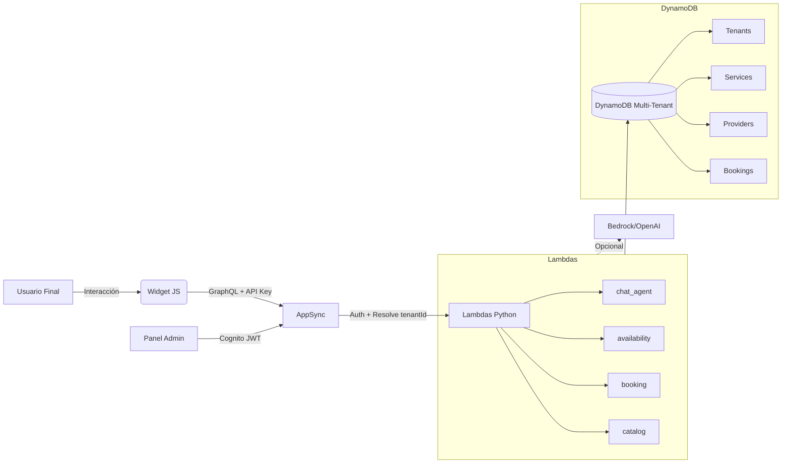

# Arquitectura Técnica del SaaS Agentic Booking Chat

Este documento describe la arquitectura técnica completa del sistema SaaS que permite a múltiples empresas integrar un **chat agéntico con flujo de reservas** en sus sitios web mediante un script embebible.

Está diseñado para ser implementado desde cero por herramientas como **Codex**, **GitHub Copilot**, o cualquier framework IaC.

---

## 🏗️ Componentes principales

La arquitectura está compuesta por 7 capas:

1. **Widget Web (JavaScript embebible)**
2. **Panel Administrativo**
3. **AppSync (GraphQL API)**
4. **Lambdas Python (lógica del agente y servicios)**
5. **DynamoDB (base de datos multi-tenant)**
6. **Módulo de AI/NLP (opcional)**
7. **CDN para distribución del widget**

---

## 🔧 1. Widget Web (JavaScript)

Se integra en cualquier sitio web usando:

```html
<script
  src="https://cdn.tu-saas.com/chat-widget.js"
  data-tenant-id="TENANT_ID"
  data-public-key="PUBLIC_KEY"
></script>
```

**Funciones del widget:**

- Renderiza interfaz del chat (React + MUI).
- Envía mensajes al backend mediante GraphQL.
- Envía el `tenantId` y la API Key en cada request.
- Puede recibir eventos vía Subscription (AppSync).
- Permite personalización visual y de comportamiento.

---

## 🧰 2. Panel Administrativo

Aplicación web (React + MUI) donde los tenants pueden:

- Crear y editar servicios.
- Administrar profesionales.
- Definir disponibilidad.
- Generar API keys.
- Configurar branding del widget.
- Ver reservas.
- Ver estadísticas de uso.

**Autenticación**: Cognito User Pools.  
El JWT del usuario incluye `tenantId` como claim.

---

## 🔌 3. AppSync GraphQL API

**Funciones principales:**
- Exponer API multi-tenant.
- Resolver mutations:
  - `sendChatMessage`
  - `createBooking`
  - `cancelBooking`
- Resolver queries:
  - `searchServices`
  - `listProvidersByService`
  - `getAvailableSlots`
  - `getBookingsByUser`
- Manejar subscriptions para chat en tiempo real.

**Autenticación:**  
Soporta 2 mecanismos:

| Uso | Método | Descripción |
|-----|--------|-------------|
| Widget público | API Key | Mapea una key al tenant |
| Panel Admin | Cognito | Usuarios admin con JWT que contiene `tenantId` |

---

## 🐍 4. Lambdas Python

Cada Lambda corresponde a un dominio funcional:

| Lambda | Rol |
|--------|-----|
| `chat_agent` | FSM conversacional, orquestación |
| `catalog` | Servicios, profesionales |
| `availability` | Cálculo de slots |
| `booking` | Reserva transaccional, condición atómica |

Todas reciben inmediatamente:

- `tenantId`
- `userContext`
- Información del mensaje

Consultan DynamoDB usando claves segmentadas por tenant.

**Python modules recomendados:**
```
/lambda/chat_agent
  handler.py
  fsm.py
  states.py
  nlp.py (opcional)
/lambda/booking
  handler.py
  create.py
  cancel.py
```

---

## 🗄️ 5. DynamoDB (Multi-Tenant)

Cada tabla contiene `tenantId` en su PK o SK.  
Los tenants se aíslan mediante claves compuestas del tipo:

```
PK = tenantId
PK = tenantId#providerId
PK = tenantId#serviceId
```

**Tablas:**

- `Tenants`
- `TenantApiKeys`
- `Services`
- `Providers`
- `ProviderAvailability`
- `Bookings`
- `ConversationState`

Detalles completos en `/architecture/dynamodb-schema.md`.

---

## 🧠 6. AI / NLP (Opcional)

Se usa para:

- Clasificar intención.
- Encontrar servicio probable.
- Mejorar naturalidad del agente.

**Opciones:**

- Amazon Bedrock (Claude, Titan, Llama)
- OpenAI API
- Modelo local embebido para costos bajos.

La Lambda `chat_agent` puede llamar a `nlp.py`.

---

## 🌐 7. CDN para Widget

El script embebible se publica en:

**CloudFront**  
→ Hosting del bundle JS del widget (React build minificado).

El widget obtiene actualizaciones automáticamente por versión:

```
https://cdn.tu-saas.com/chat-widget/VERSION/chat-widget.js
```

---

## 🔄 Flujo Principal de Arquitectura



---

## 🔒 Seguridad en la Arquitectura

- Las API Keys se almacenan hashed.
- Solo se permiten dominios registrados (`AllowedOrigins`).
- Todas las operaciones están scopeadas por `tenantId`.
- Rate limiting por tenant y por API key.
- Acceso admin mediante Cognito → JWT incluye `tenantId`.

---

## 📈 Escalabilidad

- **Serverless** (Lambdas escalan automáticamente).
- **AppSync** maneja miles de conexiones simultáneas.
- **DynamoDB** es ideal para multi-tenant de baja latencia.
- **CDN** entrega el widget globalmente.

---

## 📦 Entregables de esta arquitectura

- Widget listo para integrar.
- API GraphQL multi-tenant.
- Panel administrativo operativo.
- Flujos conversacionales en Python.
- Reservas seguras y consistentes.
- Configuración flexible por tenant.

---

## 📍 Documentos relacionados

- `/architecture/multi-tenant.md`
- `/architecture/dynamodb-schema.md`
- `/architecture/appsync-schema.md`
- `/widget/README.md`
- `/security/README.md`
