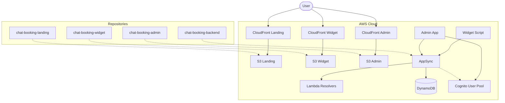

# Infrastructure Decoupling (Architecture 2.0)

**Date:** December 2025
**Status:** Implemented

## Context

Initially, the project used a shared monolithic infrastructure repository (`chat-booking-infrastructure`) that deployed all resources (VPC, AppSync, Databases, Frontends) in a single CloudFormation stack or nested stacks.

**Problems with Monolith:**
- **High Coupling:** A change in the Landing Page infra required redeploying the Backend.
- **CI/CD Bottlenecks:** Hard to trigger pipelines based on specific component changes.
- **Cognitive Load:** Developers had to understand the entire infra to change one frontend bucket.

## Solution: "You Build It, You Run It"

We successfully migrated to a **Decoupled Architecture** where each repository owns its infrastructure.

### 1. Repository Split

We now have 4 independent repositories, each with an `/infra` folder containing a dedicated AWS CDK app.

| Repository | Scope | Infrastructure Assets |
|------------|-------|----------------------|
| `chat-booking-backend` | **Core Logic** | AppSync, DynamoDB, Lambdas, Cognito User Pool, Cognito Identity Pool |
| `chat-booking-landing` | **Marketing** | S3 Bucket (Website), CloudFront Distribution |
| `chat-booking-admin` | **SaaS Dashboard** | S3 Bucket (Website), CloudFront Distribution (OAC), Amplify Auth Config |
| `chat-booking-widget` | **Embeddable Chat** | S3 Bucket (Script), CloudFront Distribution (**CORS Enabled**) |

### 2. Infrastructure Patterns

#### Backend (`chat-booking-backend/infra`)
- **AppSync Merged API**: Serves as the single gateway for all frontends.
- **Single Table Design**: One shared DynamoDB table for tenants/bookings to minimize cold starts and costs.
- **Security**:
    - **Admin Panel**: Uses `AMAZON_COGNITO_USER_POOLS` (JWT).
    - **Widget**: Uses `API_KEY` (Throttled, publicly accessible).

#### Frontends (Admin/Landing/Widget)
- **Static Hosting**: All frontends are built (Next.js export or Vite build) and synced to S3.
- **CloudFront OAC**: We use **Origin Access Control** to secure S3 buckets. They are NOT public. Only CloudFront can read them.
- **React Router Rewrite**: Admin panel CloudFront is configured to serve `index.html` for 403/404 errors to support client-side routing.

### 3. CI/CD Pipelines

Each repository has a independent `.github/workflows/deploy.yml`:

1.  **Checkout** Code.
2.  **Install** Dependencies.
3.  **Build** Artifacts (`npm run build`).
4.  **Configure** AWS Credentials (OIDC).
5.  **Deploy** Infra (`npx cdk deploy`).

This allows us to deploy a fix to the Widget in minutes without touching the Backend or Admin.

## Diagram

