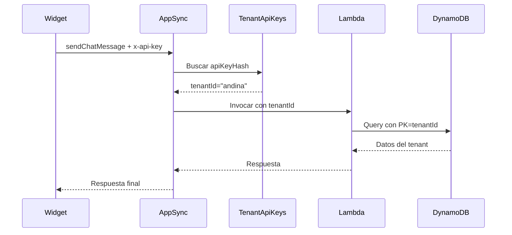

# Arquitectura Multi-Tenant para el SaaS Agentic Booking Chat

Este documento describe en profundidad el **modelo multi-tenant** que permite que múltiples empresas (tenants) utilicen la plataforma sin compartir datos entre sí, manteniendo seguridad, escalabilidad y configuraciones independientes.

---

## 🧩 Objetivo del diseño multi-tenant

La plataforma debe permitir que:

- Muchas empresas usen el chat agéntico en **sus propios sitios web**.
- Cada una administre su catálogo de servicios, profesionales y reservas.
- Cada empresa tenga sus **propias API Keys**, branding y configuraciones.
- Los datos estén completamente aislados por `tenantId`.
- El sistema escale horizontalmente de forma eficiente.

---

## 🏛️ Enfoque multi-tenant adoptado

Se utiliza una estrategia **multi-tenant lógico**, basada en:

- **Una base de datos compartida** (DynamoDB).
- **Tablas particionadas por `tenantId`**.
- **Autenticación por API Key** para widgets públicos.
- **Autenticación Cognito** para el panel admin.
- **AppSync resolviendo `tenantId`** en cada request.

Este enfoque provee:

- Bajo costo operativo.
- Máxima escalabilidad.
- Seguridad basada en aislamiento lógico.
- Simplicidad para agregar nuevos tenants.

---

## 💡 ¿Qué es un Tenant?

Un **tenant** es una empresa que usa el servicio.

Cada tenant tiene:

- Sus servicios.
- Sus profesionales.
- Su disponibilidad.
- Sus reservas.
- Sus conversaciones.
- Sus usuarios administradores.
- Sus configuraciones de widget.
- Sus planes y límites.

Todo identificado por un `tenantId` único.

---

## 🔐 1. Identificación del tenant: `tenantId`

Cada request al backend debe resolverse a un **tenantId**.

Esto ocurre de dos formas:

### 1.1. Para el widget público (sitio del cliente)

El widget embebido en el sitio contiene una `publicKey`:

```html
<script
  src="https://cdn.tu-saas.com/chat-widget.js"
  data-tenant-id="andina"
  data-public-key="pk_live_abc123"
></script>
```

El backend:

1. Recibe `x-api-key: pk_live_abc123`.
2. Calcula su hash.
3. Busca en `TenantApiKeys` → obtiene `tenantId`.
4. Valida:
   - Key activa.
   - Origen permitido.
   - Límite de uso.

### 1.2. Para el panel admin (usuarios internos del tenant)

- Login vía Cognito.
- El JWT contiene un claim `tenantId`.
- AppSync lo extrae de forma segura.

---

## 🏗️ 2. Modelo de Datos Multi-Tenant en DynamoDB

### Tablas clave:

#### ✔ **Tenants**
Información global de cada empresa.

```
PK: tenantId
```

#### ✔ **TenantApiKeys**
```
PK: tenantId
SK: apiKeyId
GSI1PK: apiKeyHash
```

Permite resolución rápida de una request → tenant.

#### ✔ **Services**
```
PK = tenantId
SK = serviceId
```

#### ✔ **Providers**
```
PK = tenantId
SK = providerId
```

#### ✔ **ProviderAvailability**
```
PK = tenantId#providerId
SK = dayOfWeek
```

#### ✔ **Bookings**
```
PK = tenantId#providerId
SK = startTime
```

Los GSIs también incluyen `tenantId`.

#### ✔ **ConversationState**
```
PK = tenantId
SK = conversationId
```

---

## 🧪 3. Aislamiento y Seguridad

### ¿Cómo aseguramos que un tenant no acceda a datos de otro?

1. **Todas las PK incluyen `tenantId`.**  
   Es imposible hacer query sin especificarlo.

2. **AppSync valida tenant antes de ejecutar el resolver.**

3. **Cada request del widget está firmada por una API Key del tenant.**

4. **Panel admin obtiene tenant desde JWT (Cognito).**

5. **Todos los lambdas reciben explícitamente `tenantId` como parámetro.**

6. **Rate limiting por tenant y por key.**

7. **Allowed Origins por key.**

---

## 🔄 4. Flujo completo de una request multi-tenant



---

## 🧠 5. Personalización por Tenant

Cada tenant puede tener configuraciones distintas:

- Idioma del widget.
- Mensaje de bienvenida.
- Colores.
- Horarios de atención.
- Políticas de reserva.
- Plan contratado (FREE/PRO/ENTERPRISE).
- Límites mensuales:
  - Mensajes
  - Reservas
  - Tokens IA

Estas configuraciones se guardan en:

```
Tenants.settings
```

**Ejemplo:**

```json
{
  "settings": {
    "language": "es-CL",
    "widget": {
      "primaryColor": "#f44336",
      "greetingMessage": "Hola, ¿en qué puedo ayudarte?"
    },
    "booking": {
      "minAdvanceMinutes": 60,
      "maxAdvanceDays": 30
    },
    "ai": {
      "provider": "bedrock",
      "model": "claude-3-sonnet"
    }
  }
}
```

---

## 📈 6. Escalabilidad Multi-Tenant

El diseño está optimizado para:

- Hasta **miles de tenants**.
- **Cientos de miles** de conversaciones simultáneas.
- **Millones de mensajes** por día.

### Por qué escala:

- **DynamoDB** escala por partición → partición = tenant.
- **Lambdas** escalan horizontalmente.
- **AppSync** maneja múltiples conexiones simultáneas.
- El widget se sirve por **CDN global**.

---

## 🧹 7. Ventajas del enfoque

### ✔ Aislamiento fuerte
Un tenant nunca verá datos de otro.

### ✔ Administración central
Todas las empresas comparten el backend.

### ✔ Flexible
Puedes mover un tenant grande a otra cuenta/región si lo necesitas.

### ✔ Observabilidad
Cada operación registra:

- `tenantId`
- `apiKeyId`
- uso de recursos
- auditoría por tenant

### ✔ Facturación por Tenant
Puedes habilitar:

- pay-per-use
- planes fijos
- límites por plan

---

## 📦 8. Resumen del diseño multi-tenant

| Componente | Mecanismo multi-tenant |
|------------|------------------------|
| Widget | API Key → `tenantId` |
| AppSync | Auth API Key o JWT → `tenantId` |
| Lambdas | Parametrizadas con `tenantId` |
| DynamoDB | PKs segmentadas por `tenantId` |
| Panel Admin | Cognito con claim `tenantId` |

---

## 📚 Documentos relacionados

- `/architecture/dynamodb-schema.md`
- `/architecture/appsync-schema.md`
- `/widget/README.md`
- `/security/README.md`
