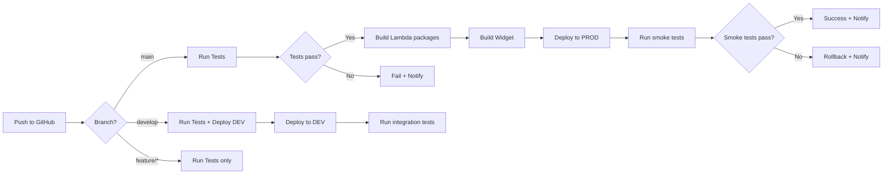

# Pipeline CI/CD — Automatización de Deploy

Este documento describe el pipeline de CI/CD para automatizar el deployment del SaaS.

---

## 🎯 Objetivos del pipeline

1. **Build automático** al hacer push a branches específicos
2. **Tests automáticos** (unit, integration, e2e)
3. **Deploy a múltiples ambientes** (dev, qa, prod)
4. **Rollback automático** en caso de fallos
5. **Notificaciones** a Slack/email

---

## 🏗️ Arquitectura del pipeline

```
GitHub → GitHub Actions → AWS CodeBuild → AWS CodeDeploy → CloudFormation/CDK
         |
         └──> Tests → Quality Gates → Deploy
```

**Alternativa**: GitLab CI, CircleCI, Jenkins

---

## 🔄 Workflow completo



---

## 🔧 GitHub Actions — Configuración completa

### Archivo: `.github/workflows/deploy.yml`

```yaml
name: Deploy Chat Booking SaaS

on:
  push:
    branches:
      - main
      - develop
  pull_request:
    branches:
      - main

env:
  AWS_REGION: us-east-1
  PYTHON_VERSION: '3.9'
  NODE_VERSION: '16'

jobs:
  # ==================
  # Job 1: Tests
  # ==================
  test:
    runs-on: ubuntu-latest
    steps:
      - name: Checkout code
        uses: actions/checkout@v3
      
      - name: Setup Python
        uses: actions/setup-python@v4
        with:
          python-version: ${{ env.PYTHON_VERSION }}
      
      - name: Install dependencies
        run: |
          cd lambda
          pip install -r requirements.txt
          pip install pytest pytest-cov
      
      - name: Run unit tests
        run: |
          cd lambda
          pytest tests/unit --cov=. --cov-report=xml
      
      - name: Upload coverage
        uses: codecov/codecov-action@v3
        with:
          file: ./lambda/coverage.xml
      
      - name: Setup Node.js
        uses: actions/setup-node@v3
        with:
          node-version: ${{ env.NODE_VERSION }}
      
      - name: Install widget dependencies
        run: |
          cd widget
          npm ci
      
      - name: Run widget tests
        run: |
          cd widget
          npm test
      
      - name: Lint
        run: |
          cd widget
          npm run lint

  # ==================
  # Job 2: Build
  # ==================
  build:
    needs: test
    runs-on: ubuntu-latest
    if: github.ref == 'refs/heads/main' || github.ref == 'refs/heads/develop'
    steps:
      - name: Checkout code
        uses: actions/checkout@v3
      
      - name: Setup Python
        uses: actions/setup-python@v4
        with:
          python-version: ${{ env.PYTHON_VERSION }}
      
      - name: Package Lambda functions
        run: |
          cd lambda
          mkdir -p dist
          
          # Package each Lambda
          for dir in */; do
            echo "Packaging ${dir%/}..."
            cd $dir
            pip install -r requirements.txt -t .
            zip -r ../dist/${dir%/}.zip .
            cd ..
          done
      
      - name: Upload Lambda artifacts
        uses: actions/upload-artifact@v3
        with:
          name: lambda-packages
          path: lambda/dist/*.zip
      
      - name: Setup Node.js
        uses: actions/setup-node@v3
        with:
          node-version: ${{ env.NODE_VERSION }}
      
      - name: Build widget
        run: |
          cd widget
          npm ci
          npm run build
      
      - name: Upload widget artifact
        uses: actions/upload-artifact@v3
        with:
          name: widget-build
          path: widget/dist/

  # ==================
  # Job 3: Deploy DEV
  # ==================
  deploy-dev:
    needs: build
    runs-on: ubuntu-latest
    if: github.ref == 'refs/heads/develop'
    environment: development
    steps:
      - name: Checkout code
        uses: actions/checkout@v3
      
      - name: Configure AWS credentials
        uses: aws-actions/configure-aws-credentials@v2
        with:
          aws-access-key-id: ${{ secrets.AWS_ACCESS_KEY_ID }}
          aws-secret-access-key: ${{ secrets.AWS_SECRET_ACCESS_KEY }}
          aws-region: ${{ env.AWS_REGION }}
      
      - name: Download Lambda artifacts
        uses: actions/download-artifact@v3
        with:
          name: lambda-packages
          path: lambda-packages/
      
      - name: Deploy Lambda functions
        run: |
          for lambda in lambda-packages/*.zip; do
            func_name=$(basename $lambda .zip)
            echo "Deploying $func_name..."
            aws lambda update-function-code \
              --function-name dev-$func_name \
              --zip-file fileb://$lambda
          done
      
      - name: Download widget artifact
        uses: actions/download-artifact@v3
        with:
          name: widget-build
          path: widget-dist/
      
      - name: Deploy widget to S3
        run: |
          aws s3 sync widget-dist/ s3://chat-booking-widget-dev/ \
            --delete \
            --cache-control "public, max-age=3600"
      
      - name: Invalidate CloudFront cache
        run: |
          aws cloudfront create-invalidation \
            --distribution-id ${{ secrets.CLOUDFRONT_DIST_ID_DEV }} \
            --paths "/*"
      
      - name: Run smoke tests
        run: |
          cd tests/smoke
          npm ci
          npm test -- --env=dev

  # ==================
  # Job 4: Deploy PROD
  # ==================
  deploy-prod:
    needs: build
    runs-on: ubuntu-latest
    if: github.ref == 'refs/heads/main'
    environment: production
    steps:
      - name: Checkout code
        uses: actions/checkout@v3
      
      - name: Configure AWS credentials
        uses: aws-actions/configure-aws-credentials@v2
        with:
          aws-access-key-id: ${{ secrets.AWS_ACCESS_KEY_ID_PROD }}
          aws-secret-access-key: ${{ secrets.AWS_SECRET_ACCESS_KEY_PROD }}
          aws-region: ${{ env.AWS_REGION }}
      
      - name: Download Lambda artifacts
        uses: actions/download-artifact@v3
        with:
          name: lambda-packages
          path: lambda-packages/
      
      - name: Create Lambda versions
        id: lambda-versions
        run: |
          for lambda in lambda-packages/*.zip; do
            func_name=$(basename $lambda .zip)
            echo "Updating $func_name..."
            
            # Update code
            aws lambda update-function-code \
              --function-name prod-$func_name \
              --zip-file fileb://$lambda
            
            # Publish version
            version=$(aws lambda publish-version \
              --function-name prod-$func_name \
              --query 'Version' \
              --output text)
            
            echo "${func_name}_version=$version" >> $GITHUB_OUTPUT
          done
      
      - name: Update Lambda aliases
        run: |
          for lambda in lambda-packages/*.zip; do
            func_name=$(basename $lambda .zip)
            version=${{ steps.lambda-versions.outputs[format('{0}_version', func_name)] }}
            
            # Update LIVE alias
            aws lambda update-alias \
              --function-name prod-$func_name \
              --name LIVE \
              --function-version $version
          done
      
      - name: Download widget artifact
        uses: actions/download-artifact@v3
        with:
          name: widget-build
          path: widget-dist/
      
      - name: Deploy widget to S3 with versioning
        run: |
          VERSION=$(git rev-parse --short HEAD)
          
          # Upload to versioned path
          aws s3 sync widget-dist/ s3://chat-booking-widget-prod/$VERSION/ \
            --cache-control "public, max-age=31536000, immutable"
          
          # Upload to /latest (short cache)
          aws s3 sync widget-dist/ s3://chat-booking-widget-prod/latest/ \
            --cache-control "public, max-age=3600"
      
      - name: Invalidate CloudFront cache
        run: |
          aws cloudfront create-invalidation \
            --distribution-id ${{ secrets.CLOUDFRONT_DIST_ID_PROD }} \
            --paths "/latest/*"
      
      - name: Run smoke tests
        id: smoke-tests
        run: |
          cd tests/smoke
          npm ci
          npm test -- --env=prod
      
      - name: Rollback on failure
        if: failure() && steps.smoke-tests.outcome == 'failure'
        run: |
          echo "Smoke tests failed, rolling back..."
          
          # Get previous version from aliases
          for lambda in lambda-packages/*.zip; do
            func_name=$(basename $lambda .zip)
            
            # Get current LIVE version
            current=$(aws lambda get-alias \
              --function-name prod-$func_name \
              --name LIVE \
              --query 'FunctionVersion' \
              --output text)
            
            # Get previous version (current - 1)
            previous=$((current - 1))
            
            # Rollback alias
            aws lambda update-alias \
              --function-name prod-$func_name \
              --name LIVE \
              --function-version $previous
          done
      
      - name: Notify Slack on success
        if: success()
        uses: slackapi/slack-github-action@v1
        with:
          webhook-url: ${{ secrets.SLACK_WEBHOOK_URL }}
          payload: |
            {
              "text": "✅ Deploy to PROD successful!",
              "blocks": [
                {
                  "type": "section",
                  "text": {
                    "type": "mrkdwn",
                    "text": "*Deploy to PROD successful!*\nCommit: ${{ github.sha }}\nActor: ${{ github.actor }}"
                  }
                }
              ]
            }
      
      - name: Notify Slack on failure
        if: failure()
        uses: slackapi/slack-github-action@v1
        with:
          webhook-url: ${{ secrets.SLACK_WEBHOOK_URL }}
          payload: |
            {
              "text": "❌ Deploy to PROD failed!",
              "blocks": [
                {
                  "type": "section",
                  "text": {
                    "type": "mrkdwn",
                    "text": "*Deploy to PROD FAILED!*\nCommit: ${{ github.sha }}\nActor: ${{ github.actor }}\nCheck logs: ${{ github.server_url }}/${{ github.repository }}/actions/runs/${{ github.run_id }}"
                  }
                }
              ]
            }

  # ==================
  # Job 5: Integration Tests
  # ==================
  integration-tests:
    needs: deploy-prod
    runs-on: ubuntu-latest
    if: github.ref == 'refs/heads/main'
    steps:
      - name: Checkout code
        uses: actions/checkout@v3
      
      - name: Setup Node.js
        uses: actions/setup-node@v3
        with:
          node-version: ${{ env.NODE_VERSION }}
      
      - name: Run integration tests
        run: |
          cd tests/integration
          npm ci
          npm test -- --env=prod
        env:
          API_URL: ${{ secrets.APPSYNC_API_URL_PROD }}
          API_KEY: ${{ secrets.API_KEY_TEST }}
```

---

## 🧪 Tests en el pipeline

### Unit Tests (Lambda)

```python
# tests/unit/test_chat_agent.py
import pytest
from chat_agent.fsm import ConversationFSM

def test_init_state():
    fsm = ConversationFSM('test_tenant')
    result = fsm.process_message(None, 'Necesito un masaje', {})
    
    assert result['message']['sender'] == 'AGENT'
    assert len(result['suggestedServices']) > 0

def test_service_selection():
    fsm = ConversationFSM('test_tenant')
    # ... más tests
```

### Integration Tests (API)

```javascript
// tests/integration/booking.test.js
const { GraphQLClient } = require('graphql-request');

const client = new GraphQLClient(process.env.API_URL, {
  headers: {
    'x-api-key': process.env.API_KEY
  }
});

describe('Booking Flow', () => {
  it('should create a booking successfully', async () => {
    const mutation = `
      mutation {
        createBooking(input: {
          serviceId: "svc_test"
          providerId: "pro_test"
          start: "2025-12-10T15:00:00Z"
          customerEmail: "test@example.com"
        }) {
          id
          status
        }
      }
    `;
    
    const result = await client.request(mutation);
    expect(result.createBooking.status).toBe('PENDING');
  });
});
```

### Smoke Tests (Post-deploy)

```javascript
// tests/smoke/widget.test.js
const puppeteer = require('puppeteer');

describe('Widget Smoke Tests', () => {
  let browser, page;
  
  beforeAll(async () => {
    browser = await puppeteer.launch();
    page = await browser.newPage();
  });
  
  it('should load widget on page', async () => {
    await page.goto('https://test-site.com');
    
    // Wait for widget to load
    await page.waitForSelector('#chat-agent-widget-launcher');
    
    // Click to open
    await page.click('#chat-agent-widget-launcher');
    
    // Verify chat window appears
    const chatWindow = await page.$('#chat-agent-widget-window');
    expect(chatWindow).toBeTruthy();
  });
  
  afterAll(async () => {
    await browser.close();
  });
});
```

---

## 🔐 Secrets en GitHub

Configurar en **Settings → Secrets and variables → Actions**:

```
AWS_ACCESS_KEY_ID
AWS_SECRET_ACCESS_KEY
AWS_ACCESS_KEY_ID_PROD
AWS_SECRET_ACCESS_KEY_PROD
CLOUDFRONT_DIST_ID_DEV
CLOUDFRONT_DIST_ID_PROD
APPSYNC_API_URL_PROD
API_KEY_TEST
SLACK_WEBHOOK_URL
```

---

## 📊 Monitoreo del pipeline

### Badges en README

```markdown


[](https://codecov.io/gh/tu-org/chat-booking-saas)
```

### Notificaciones

- ✅ **Slack**: Deploy exitoso/fallido
- 📧 **Email**: Solo en fallos críticos
- 📱 **PagerDuty**: Para producción

---

## 🔄 Estrategias de deploy

### Blue/Green Deployment

```yaml
# Lambda con alias BLUE y GREEN
# Traffic shifting gradual

aws lambda update-alias \
  --function-name prod-chat-agent \
  --name LIVE \
  --routing-config AdditionalVersionWeights={"2"=0.1}

# Incrementar gradualmente
# 10% → 25% → 50% → 100%
```

### Canary Deployment

```yaml
# AppSync: routing 10% a nueva versión
# Monitorear errores por 1 hora
# Si OK, 100%, si no, rollback
```

---

## 🆘 Rollback manual

```bash
# Rollback Lambda
aws lambda update-alias \
  --function-name prod-chat-agent \
  --name LIVE \
  --function-version <PREVIOUS_VERSION>

# Rollback Widget (cambiar CloudFront origin)
aws cloudfront update-distribution \
  --id DIST_ID \
  --distribution-config file://rollback-config.json
```

---

## 📚 Documentos relacionados

- [Deployment Guide](/deployment/README.md)
- [Arquitectura](/architecture/README.md)
- [Testing Strategy](/tests/README.md)
