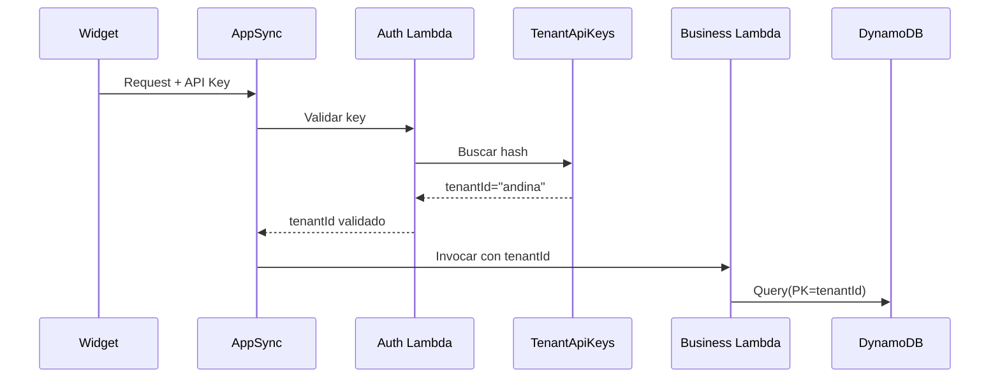

# Seguridad — SaaS Multi-Tenant

Este documento describe el modelo de seguridad implementado en el SaaS Agentic Booking Chat.

---

## 🔒 Principios de seguridad

1. **Aislamiento por tenant**: Datos completamente separados
2. **Autenticación robusta**: Cognito para admins, API Keys para widgets
3. **Autorización granular**: Permisos por rol
4. **Encriptación**: En tránsito y en reposo
5. **Auditoría completa**: Todos los accesos registrados
6. **Rate limiting**: Protección contra abuso

---

## 🔐 Autenticación

### 1. Panel Administrativo (Cognito)

**Método**: AWS Cognito User Pools

**Flujo**:
1. Usuario accede a `https://app.tu-saas.com`
2. Login con email + password
3. Cognito valida credenciales
4. Retorna JWT con claims:
   ```json
   {
     "sub": "user_123",
     "email": "admin@empresa.com",
     "custom:tenantId": "andina",
     "cognito:groups": ["admin"]
   }
   ```
5. JWT incluido en cada request a AppSync

**Seguridad adicional**:
- MFA opcional
- Política de contraseñas fuerte
- Sesiones con expiración
- Refresh tokens rotados

---

### 2. Widget Público (API Keys)

**Método**: API Key firmada

**Flujo**:
1. Widget envía `x-api-key: pk_live_abc123`
2. AppSync/Lambda calcula hash de la key
3. Busca en tabla `TenantApiKeys` (GSI por hash)
4. Valida:
   - Key activa
   - Dominio en `allowedOrigins`
   - No excede rate limit
5. Resuelve `tenantId`
6. Request procede con contexto del tenant

**Generación de API Keys**:
```python
import secrets
import hashlib

def generate_api_key():
    # Generar key aleatoria
    key = f"pk_live_{secrets.token_urlsafe(32)}"
    
    # Hash para guardar en DB
    key_hash = hashlib.sha256(key.encode()).hexdigest()
    
    return key, key_hash
```

**Almacenamiento**:
- ❌ Nunca guardar la key en texto plano
- ✅ Solo guardar el hash
- ✅ La key se muestra solo una vez al crearla

---

## 🛡️ Aislamiento Multi-Tenant

### Nivel de base de datos

Cada tabla en DynamoDB incluye `tenantId` en su clave primaria:

```
PK = tenantId
PK = tenantId#providerId
PK = tenantId#serviceId
```

**Imposibilita** queries accidentales cross-tenant.

### Nivel de aplicación

Toda Lambda recibe `tenantId` como parámetro obligatorio:

```python
def lambda_handler(event, context):
    tenant_id = event['tenantId']
    
    # Todas las operaciones usan tenant_id
    services = get_services(tenant_id)
```

### Validación en cada capa



---

## 🚪 Autorización (RBAC)

### Roles disponibles

| Rol | Panel Admin | Widget Config | Ver Reservas | Gestionar Catálogo |
|-----|-------------|---------------|--------------|-------------------|
| **Admin** | ✅ | ✅ | ✅ | ✅ |
| **Staff** | ✅ | ❌ | ✅ | ✅ |
| **Viewer** | ✅ | ❌ | ✅ | ❌ |

### Implementación en Cognito

Roles se asignan como **Cognito Groups**.

El JWT incluye:
```json
{
  "cognito:groups": ["admin", "reports"]
}
```

AppSync valida permisos en los resolvers:

```vtl
#if( !$ctx.identity.claims.get("cognito:groups").contains("admin") )
  $util.unauthorized()
#end
```

---

## 🔒 API Keys — Seguridad avanzada

### Allowed Origins (CORS)

Cada API Key tiene lista de dominios permitidos:

```json
{
  "apiKeyId": "key_001",
  "allowedOrigins": [
    "https://www.empresa.com",
    "https://empresa.com",
    "https://app.empresa.com"
  ]
}
```

**Validación**:
```python
def validate_origin(api_key, origin):
    key_data = get_api_key(api_key)
    
    if origin not in key_data['allowedOrigins']:
        raise Exception('Origin not allowed')
```

### Scopes (permisos granulares)

Cada key puede tener scopes limitados:

```json
{
  "scopes": [
    "widget:chat",
    "widget:booking",
    "widget:catalog"
  ]
}
```

Validas en cada operación:
```python
if 'widget:booking' not in api_key_data['scopes']:
    raise Exception('Insufficient permissions')
```

### Rotación de keys

**Buena práctica**: Rotar keys periódicamente.

En el panel admin:
1. Crear nueva key
2. Actualizar widget en sitio
3. Esperar propagación (24-48h)
4. Revocar key antigua

### Expiración automática

Puedes configurar keys con TTL:

```json
{
  "apiKeyId": "key_001",
  "expiresAt": "2026-01-01T00:00:00Z"
}
```

Lambda valida antes de usar:
```python
from datetime import datetime

def validate_expiration(api_key_data):
    if 'expiresAt' in api_key_data:
        expires = datetime.fromisoformat(api_key_data['expiresAt'])
        if datetime.utcnow() > expires:
            raise Exception('API Key expired')
```

---

## 🚦 Rate Limiting

### Por API Key

Cada key tiene límite de requests/minuto:

```json
{
  "apiKeyId": "key_001",
  "rateLimitPerMinute": 100
}
```

**Implementación** (Redis o DynamoDB):

```python
import time

def check_rate_limit(api_key_id, limit):
    key = f"rate_limit:{api_key_id}:{int(time.time() / 60)}"
    
    current = redis.incr(key)
    redis.expire(key, 60)
    
    if current > limit:
        raise Exception('Rate limit exceeded')
```

### Por Tenant

Límite global por tenant (según plan):

| Plan | Mensajes/mes | Reservas/mes | Requests/min |
|------|--------------|--------------|--------------|
| FREE | 500 | 50 | 10 |
| PRO | 10,000 | 1,000 | 100 |
| ENTERPRISE | Ilimitado | Ilimitado | 1,000 |

Validación en Lambda:
```python
def check_tenant_limits(tenant_id, operation):
    tenant = get_tenant(tenant_id)
    usage = get_monthly_usage(tenant_id)
    
    limits = PLAN_LIMITS[tenant['plan']]
    
    if operation == 'message':
        if usage['messages'] >= limits['messages']:
            raise Exception('Monthly message limit exceeded')
```

---

## 🔐 Encriptación

### En tránsito

- ✅ Todo el tráfico usa **HTTPS/TLS 1.3**
- ✅ AppSync solo acepta conexiones seguras
- ✅ Certificados gestionados por AWS Certificate Manager

### En reposo

- ✅ DynamoDB con **encryption at rest** habilitado
- ✅ S3 (si se usa) con **SSE-S3** o **SSE-KMS**
- ✅ Lambda environment variables encriptadas con KMS

### Datos sensibles

**API Keys**:
- Guardadas como hash (SHA256)
- Salt por tenant

**Información de clientes**:
- Emails y teléfonos encriptados en DynamoDB (opcional)
- PII no se envía a servicios de AI externos

---

## 📝 Auditoría y Logging

### CloudWatch Logs

Todas las Lambdas loggean:

```python
import json
import logging

logger = logging.getLogger()
logger.setLevel(logging.INFO)

def lambda_handler(event, context):
    logger.info(json.dumps({
        'tenantId': event['tenantId'],
        'operation': 'createBooking',
        'timestamp': datetime.utcnow().isoformat(),
        'userId': event.get('userId'),
        'apiKeyId': event.get('apiKeyId')
    }))
```

### DynamoDB Streams (auditoría completa)

Habilitar streams en tablas críticas:
- `Bookings`
- `TenantApiKeys`
- `Tenants`

Lambda procesa eventos:
```python
def audit_stream_handler(event, context):
    for record in event['Records']:
        if record['eventName'] == 'MODIFY':
            old = record['dynamodb']['OldImage']
            new = record['dynamodb']['NewImage']
            
            # Guardar en tabla Audit
            save_audit_log({
                'tenantId': new['tenantId']['S'],
                'table': record['eventSourceARN'].split('/')[1],
                'operation': 'UPDATE',
                'changedBy': context.identity,
                'changes': diff(old, new)
            })
```

### CloudTrail

Habilitar CloudTrail para registrar:
- Accesos a AWS Console
- Cambios en configuración de AppSync
- Modificaciones de IAM roles

---

## 🛡️ Protección contra ataques

### SQL Injection

❌ No aplica (no usamos SQL).

DynamoDB usa queries parametrizadas nativamente.

### XSS (Cross-Site Scripting)

Widget sanitiza inputs:

```javascript
function sanitizeMessage(text) {
  const div = document.createElement('div');
  div.textContent = text;
  return div.innerHTML;
}
```

Backend también valida:
```python
import html

def sanitize(text):
    return html.escape(text)
```

### CSRF

AppSync usa:
- JWT en headers (no cookies)
- Origin validation

### DDoS

Mitigación en capas:

1. **CloudFront**: AWS Shield Standard
2. **AppSync**: Rate limiting integrado
3. **Lambda**: Throttling configurado
4. **DynamoDB**: On-demand scaling

---

## 🔍 Monitoreo de seguridad

### Alertas configuradas

- Intento de acceso con key revocada
- Exceso de requests fallidos (posible ataque)
- Cambio en configuración de tenant
- Acceso desde IP sospechosa

### Herramientas

- **CloudWatch Alarms**
- **GuardDuty** para detección de amenazas
- **Security Hub** para compliance
- **Macie** para detectar PII expuesta

---

## 📋 Checklist de seguridad

### Para desarrollo

- [ ] API Keys nunca en código
- [ ] Variables sensibles en AWS Secrets Manager
- [ ] Logs no incluyen PII
- [ ] Tests de seguridad automatizados

### Para producción

- [ ] MFA habilitado para admins
- [ ] CloudTrail activo
- [ ] Encryption at rest en todas las tablas
- [ ] Backup automático de DynamoDB
- [ ] WAF configurado en CloudFront
- [ ] Rate limiting activo
- [ ] Monitoreo 24/7
- [ ] Plan de respuesta a incidentes

---

## 🆘 Respuesta a incidentes

### Procedimiento

1. **Detectar**: Alarma en CloudWatch
2. **Contener**: Revocar API Keys afectadas
3. **Investigar**: Revisar CloudWatch Logs y CloudTrail
4. **Remediar**: Rotar keys, actualizar permisos
5. **Comunicar**: Notificar a tenants afectados
6. **Documentar**: Postmortem del incidente

---

## 📚 Documentos relacionados

- [Arquitectura Multi-Tenant](/architecture/multi-tenant.md)
- [Schema DynamoDB](/architecture/dynamodb-schema.md)
- [Deployment](/deployment/README.md)
