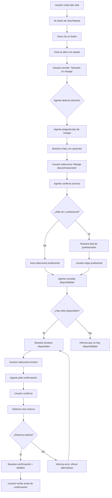
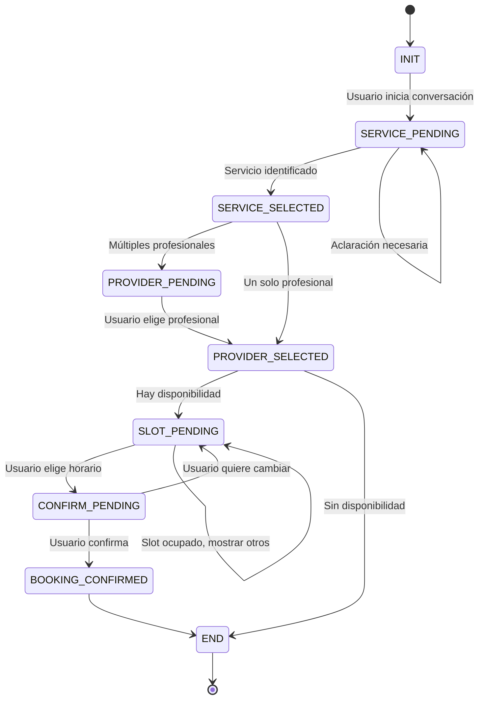

# Flujo de Uso — Chat Agéntico de Reservas

Este documento describe el flujo completo de interacción con el chat agéntico desde la perspectiva del usuario final y del sistema.

---

## 👤 Perspectiva del Usuario Final

### Flujo típico de reserva



---

## 🤖 Máquina de Estados del Agente (FSM)

### Estados disponibles



### Descripción de estados

| Estado | Descripción | Siguiente estado |
|--------|-------------|------------------|
| `INIT` | Conversación iniciada, sin intención clara | `SERVICE_PENDING` |
| `SERVICE_PENDING` | Agente necesita identificar servicio | `SERVICE_SELECTED` |
| `SERVICE_SELECTED` | Servicio confirmado | `PROVIDER_PENDING` o `PROVIDER_SELECTED` |
| `PROVIDER_PENDING` | Usuario debe elegir profesional | `PROVIDER_SELECTED` |
| `PROVIDER_SELECTED` | Profesional seleccionado | `SLOT_PENDING` |
| `SLOT_PENDING` | Usuario debe elegir horario | `CONFIRM_PENDING` |
| `CONFIRM_PENDING` | Esperando confirmación final | `BOOKING_CONFIRMED` |
| `BOOKING_CONFIRMED` | Reserva creada exitosamente | `END` |

---

## 💬 Ejemplos de conversación

### Ejemplo 1: Flujo completo exitoso

```
👤 Usuario: Hola
🤖 Agente: ¡Hola! ¿En qué puedo ayudarte hoy?

👤 Usuario: Necesito un masaje
🤖 Agente: Perfecto, ¿qué tipo de masaje buscas?
         [Masaje descontracturante] [Masaje relajante] [Masaje deportivo]

👤 Usuario: [selecciona "Masaje descontracturante"]
🤖 Agente: Excelente elección. Estos son los profesionales disponibles:
         
         👩 María González - 5 años de experiencia
         [Elegir a María]
         
         👨 Juan Pérez - 3 años de experiencia
         [Elegir a Juan]

👤 Usuario: [selecciona "María"]
🤖 Agente: Perfecto. Estos son los horarios disponibles para María:
         
         📅 Hoy 16:00
         📅 Hoy 17:30
         📅 Mañana 10:00
         📅 Mañana 11:30

👤 Usuario: [selecciona "Hoy 17:30"]
🤖 Agente: ¿Confirmas tu reserva?
         
         📋 Servicio: Masaje descontracturante (60 min)
         👩 Profesional: María González
         📅 Fecha: Hoy 1 de diciembre
         🕐 Hora: 17:30
         💰 Precio: $25.000
         
         [Confirmar] [Cambiar horario]

👤 Usuario: [Confirmar]
🤖 Agente: ¡Listo! Tu reserva está confirmada.
         
         ✅ Reserva #12345
         📧 Te enviamos un email con los detalles
         📲 Recibirás un recordatorio 24 horas antes
         
         ¿Necesitas algo más?
```

### Ejemplo 2: Sin disponibilidad

```
👤 Usuario: Quiero una sesión de kinesiología
🤖 Agente: Entendido. ¿Con qué profesional prefieres?
         [Dr. Carlos Soto] [Dra. Ana López]

👤 Usuario: [selecciona "Dr. Carlos Soto"]
🤖 Agente: Lamentablemente el Dr. Carlos Soto no tiene disponibilidad 
         en los próximos 7 días.
         
         ¿Te gustaría ver la disponibilidad de:
         👩 Dra. Ana López
         
         O prefieres que te avisemos cuando el Dr. Soto tenga horarios?
         
         [Ver a Dra. López] [Avisarme después]
```

### Ejemplo 3: Slot ocupado mientras el usuario decide

```
👤 Usuario: [selecciona "Hoy 17:30"]
🤖 Agente: ⚠️ Lo siento, ese horario acaba de ser reservado por otro usuario.
         
         Aquí tienes otros horarios disponibles:
         📅 Hoy 18:00
         📅 Mañana 10:00
         📅 Mañana 15:00
```

---

## 🔄 Casos especiales

### Cambio de opinión

El usuario puede regresar en cualquier momento:

```
[En estado PROVIDER_SELECTED]

👤 Usuario: Mejor quiero otro servicio
🤖 Agente: Sin problema, ¿qué servicio prefieres?
         [vuelve a SERVICE_PENDING]
```

### Conversación ambigua

```
👤 Usuario: Quiero algo para relajarme
🤖 Agente: Entiendo. Tenemos varias opciones para relajarte:
         
         💆 Masaje relajante
         🧘 Sesión de yoga
         🌿 Aromaterapia
         
         ¿Cuál te interesa más?
```

### Usuario pide información adicional

```
👤 Usuario: ¿Cuánto dura el masaje?
🤖 Agente: El Masaje descontracturante dura 60 minutos.
         
         ¿Te gustaría continuar con la reserva?
         [Sí, continuar] [Ver otros servicios]
```

---

## 📊 Métricas del flujo

### Puntos de medición

| Punto | Métrica | Objetivo |
|-------|---------|----------|
| Inicio conversación | `conversationStarted` | 100% |
| Servicio identificado | `serviceIdentified` | >80% |
| Profesional seleccionado | `providerSelected` | >90% |
| Horario elegido | `slotSelected` | >70% |
| Reserva confirmada | `bookingConfirmed` | >60% |

### Tasa de conversión

```
Tasa de conversión = (Reservas confirmadas / Conversaciones iniciadas) * 100
```

**Benchmark**: 40-60% es excelente para un chat agéntico.

### Puntos de abandono

Analizar dónde los usuarios abandonan:

1. **Inicio → Servicio**: Mensaje de bienvenida no claro
2. **Servicio → Profesional**: Opciones confusas
3. **Profesional → Horario**: Sin disponibilidad
4. **Horario → Confirmación**: Proceso muy largo
5. **Confirmación → Reserva**: Error técnico

---

## 🎯 Optimizaciones del flujo

### Reducir fricción

✅ **Auto-selección**: Si solo hay 1 opción, seleccionar automáticamente
✅ **Contexto del usuario**: Si está logueado, pre-rellenar datos
✅ **Sugerencias inteligentes**: Basadas en historial
✅ **Slots recomendados**: "Los clientes suelen elegir..."

### Manejo de errores

✅ **Reintentos automáticos**: Si falla una consulta
✅ **Alternativas**: Siempre ofrecer opciones
✅ **Mensajes claros**: Sin jerga técnica

### Personalización

✅ **Saludos personalizados**: "Hola Juan, ¿en qué te ayudo?"
✅ **Recordar preferencias**: "¿Quieres reservar con María como siempre?"
✅ **Horarios favoritos**: Sugerir horarios similares a reservas previas

---

## 🧪 Testing del flujo

### Casos de prueba mínimos

1. ✅ Usuario completa reserva exitosamente
2. ✅ Usuario cambia de servicio a mitad de camino
3. ✅ No hay disponibilidad para el profesional elegido
4. ✅ Slot se ocupa mientras usuario decide
5. ✅ Usuario cancela en último momento
6. ✅ Error de red durante la reserva
7. ✅ Usuario escribe mensajes ambiguos
8. ✅ Usuario hace pregunta fuera de contexto

---

## 📚 Documentos relacionados

- [Diagramas de secuencia](/usage/sequence-diagrams.md)
- [Arquitectura del agente](/architecture/lambdas.md)
- [Widget — API](/widget/api-reference.md)
