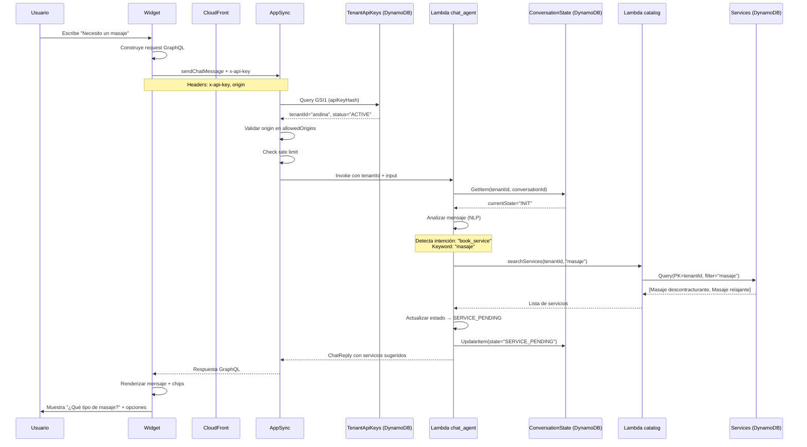
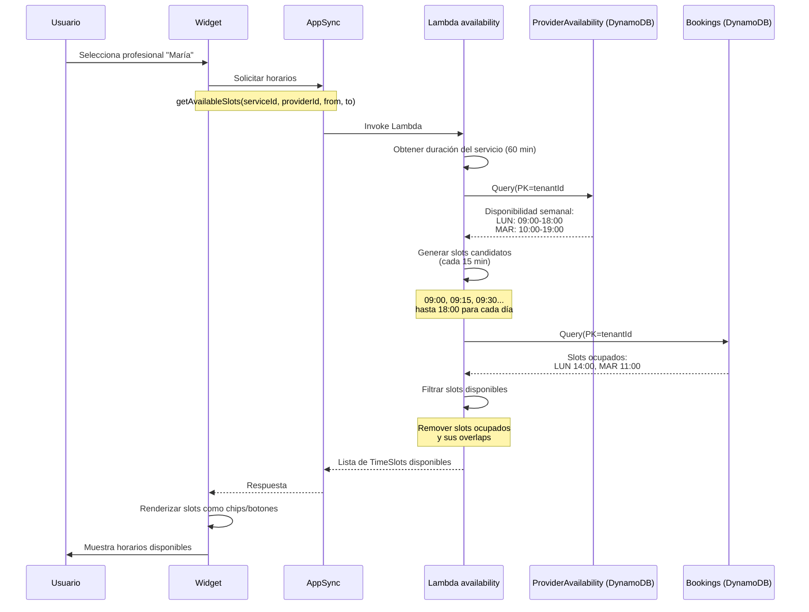
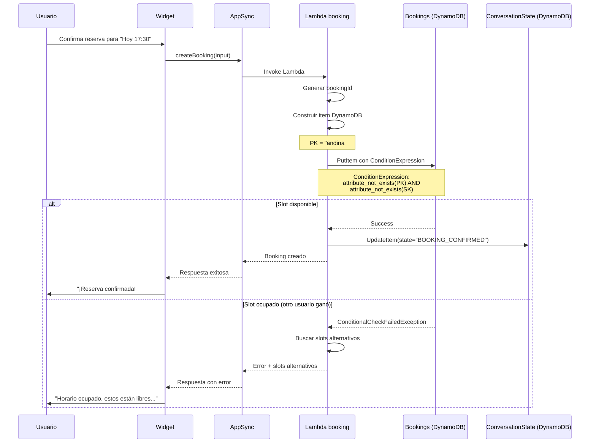
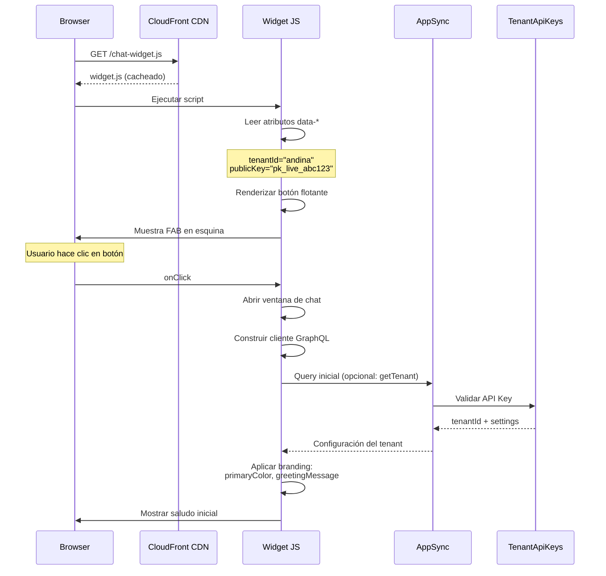
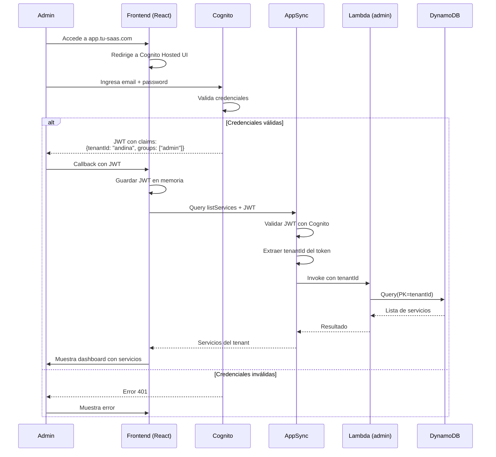
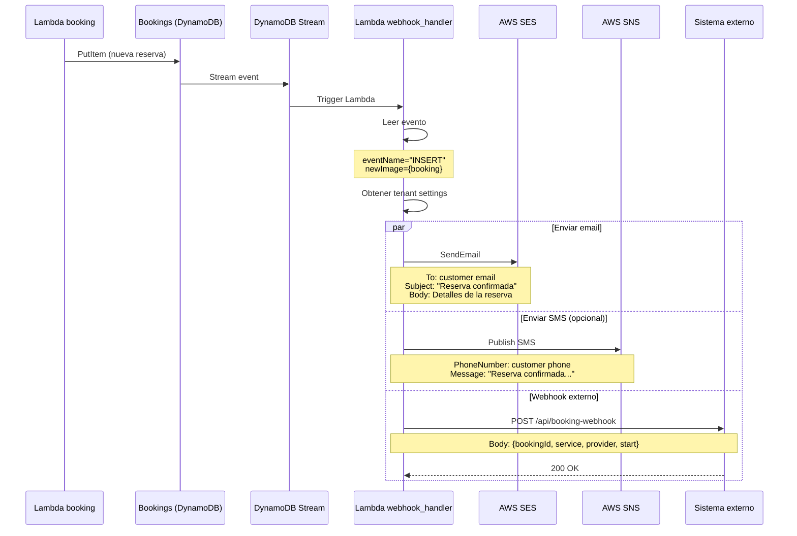
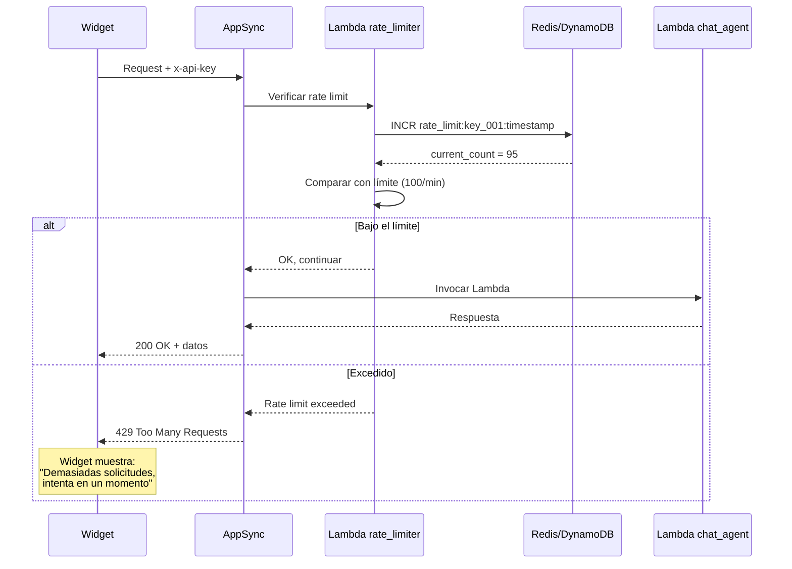
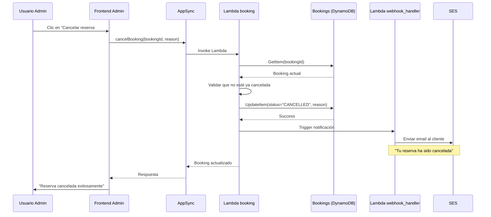

# Diagramas de Secuencia — Flujos del Sistema

Este documento contiene diagramas de secuencia detallados para los flujos principales del sistema.

---

## 📋 Flujo 1: Enviar mensaje y recibir respuesta

---

## 📋 Flujo 2: Consultar disponibilidad

---

## 📋 Flujo 3: Crear reserva (con prevención de overbooking)

---

## 📋 Flujo 4: Inicialización del Widget

---

## 📋 Flujo 5: Autenticación Admin Panel

---

## 📋 Flujo 6: Webhook de notificación

---

## 📋 Flujo 7: Rate Limiting

---

## 📋 Flujo 8: Cancelación de reserva

---

## 📚 Documentos relacionados

- [Flujos de negocio](/usage/README.md)
- [Arquitectura de Lambdas](/architecture/lambdas.md)
- [Schema GraphQL](/architecture/appsync-schema.md)
