# Diagramas de Secuencia — Flujos del Sistema

Este documento contiene diagramas de secuencia detallados para los flujos principales del sistema.

---

## 📋 Flujo 1: Enviar mensaje y recibir respuesta

```mermaid
sequenceDiagram
    participant U as Usuario
    participant W as Widget
    participant CF as CloudFront
    participant AS as AppSync
    participant AK as TenantApiKeys (DynamoDB)
    participant LA as Lambda chat_agent
    participant CS as ConversationState (DynamoDB)
    participant CA as Lambda catalog
    participant SV as Services (DynamoDB)

    U->>W: Escribe "Necesito un masaje"
    W->>W: Construye request GraphQL
    
    W->>AS: sendChatMessage + x-api-key
    Note over W,AS: Headers: x-api-key, origin
    
    AS->>AK: Query GSI1 (apiKeyHash)
    AK-->>AS: tenantId="andina", status="ACTIVE"
    
    AS->>AS: Validar origin en allowedOrigins
    AS->>AS: Check rate limit
    
    AS->>LA: Invoke con tenantId + input
    
    LA->>CS: GetItem(tenantId, conversationId)
    CS-->>LA: currentState="INIT"
    
    LA->>LA: Analizar mensaje (NLP)
    Note over LA: Detecta intención: "book_service"<br/>Keyword: "masaje"
    
    LA->>CA: searchServices(tenantId, "masaje")
    CA->>SV: Query(PK=tenantId, filter="masaje")
    SV-->>CA: [Masaje descontracturante, Masaje relajante]
    CA-->>LA: Lista de servicios
    
    LA->>LA: Actualizar estado → SERVICE_PENDING
    LA->>CS: UpdateItem(state="SERVICE_PENDING")
    
    LA-->>AS: ChatReply con servicios sugeridos
    AS-->>W: Respuesta GraphQL
    
    W->>W: Renderizar mensaje + chips
    W->>U: Muestra "¿Qué tipo de masaje?" + opciones
```

---

## 📋 Flujo 2: Consultar disponibilidad

```mermaid
sequenceDiagram
    participant U as Usuario
    participant W as Widget
    participant AS as AppSync
    participant LA as Lambda availability
    participant PA as ProviderAvailability (DynamoDB)
    participant BK as Bookings (DynamoDB)

    U->>W: Selecciona profesional "María"
    W->>AS: Solicitar horarios
    Note over W,AS: getAvailableSlots(serviceId, providerId, from, to)
    
    AS->>LA: Invoke Lambda
    
    LA->>LA: Obtener duración del servicio (60 min)
    
    LA->>PA: Query(PK=tenantId#providerId)
    PA-->>LA: Disponibilidad semanal:<br/>LUN: 09:00-18:00<br/>MAR: 10:00-19:00
    
    LA->>LA: Generar slots candidatos<br/>(cada 15 min)
    Note over LA: 09:00, 09:15, 09:30...<br/>hasta 18:00 para cada día
    
    LA->>BK: Query(PK=tenantId#providerId, SK between dates)
    BK-->>LA: Slots ocupados:<br/>LUN 14:00, MAR 11:00
    
    LA->>LA: Filtrar slots disponibles
    Note over LA: Remover slots ocupados<br/>y sus overlaps
    
    LA-->>AS: Lista de TimeSlots disponibles
    AS-->>W: Respuesta
    
    W->>W: Renderizar slots como chips/botones
    W->>U: Muestra horarios disponibles
```

---

## 📋 Flujo 3: Crear reserva (con prevención de overbooking)

```mermaid
sequenceDiagram
    participant U as Usuario
    participant W as Widget
    participant AS as AppSync
    participant LA as Lambda booking
    participant BK as Bookings (DynamoDB)
    participant CS as ConversationState (DynamoDB)

    U->>W: Confirma reserva para "Hoy 17:30"
    W->>AS: createBooking(input)
    
    AS->>LA: Invoke Lambda
    
    LA->>LA: Generar bookingId
    LA->>LA: Construir item DynamoDB
    
    Note over LA: PK = "andina#pro_55"<br/>SK = "2025-12-01T17:30:00Z"<br/>bookingId = "book_789"
    
    LA->>BK: PutItem con ConditionExpression
    Note over LA,BK: ConditionExpression:<br/>attribute_not_exists(PK) AND<br/>attribute_not_exists(SK)
    
    alt Slot disponible
        BK-->>LA: Success
        
        LA->>CS: UpdateItem(state="BOOKING_CONFIRMED")
        LA-->>AS: Booking creado
        AS-->>W: Respuesta exitosa
        W->>U: "¡Reserva confirmada! #12345"
    else Slot ocupado (otro usuario ganó)
        BK-->>LA: ConditionalCheckFailedException
        
        LA->>LA: Buscar slots alternativos
        LA-->>AS: Error + slots alternativos
        AS-->>W: Respuesta con error
        W->>U: "Horario ocupado, estos están libres..."
    end
```

---

## 📋 Flujo 4: Inicialización del Widget

```mermaid
sequenceDiagram
    participant B as Browser
    participant CF as CloudFront CDN
    participant W as Widget JS
    participant AS as AppSync
    participant AK as TenantApiKeys

    B->>CF: GET /chat-widget.js
    CF-->>B: widget.js (cacheado)
    
    B->>W: Ejecutar script
    W->>W: Leer atributos data-*
    Note over W: tenantId="andina"<br/>publicKey="pk_live_abc123"
    
    W->>W: Renderizar botón flotante
    W->>B: Muestra FAB en esquina
    
    Note over B: Usuario hace clic en botón
    
    B->>W: onClick
    W->>W: Abrir ventana de chat
    W->>W: Construir cliente GraphQL
    
    W->>AS: Query inicial (opcional: getTenant)
    AS->>AK: Validar API Key
    AK-->>AS: tenantId + settings
    AS-->>W: Configuración del tenant
    
    W->>W: Aplicar branding:<br/>primaryColor, greetingMessage
    W->>B: Mostrar saludo inicial
```

---

## 📋 Flujo 5: Autenticación Admin Panel

---

## 📋 Flujo 6: Webhook de notificación

---

## 📋 Flujo 7: Rate Limiting

---

## 📋 Flujo 8: Cancelación de reserva

```mermaid
sequenceDiagram
    participant U as Usuario Admin
    participant FE as Frontend Admin
    participant AS as AppSync
    participant LA as Lambda booking
    participant BK as Bookings (DynamoDB)
    participant WH as Lambda webhook_handler
    participant SES as SES

    U->>FE: Clic en "Cancelar reserva #12345"
    FE->>AS: cancelBooking(bookingId, reason)
    
    AS->>LA: Invoke Lambda
    
    LA->>BK: GetItem(bookingId)
    BK-->>LA: Booking actual
    
    LA->>LA: Validar que no esté ya cancelada
    
    LA->>BK: UpdateItem(status="CANCELLED", reason)
    BK-->>LA: Success
    
    LA->>WH: Trigger notificación
    WH->>SES: Enviar email al cliente
    Note over WH,SES: "Tu reserva ha sido cancelada"
    
    LA-->>AS: Booking actualizado
    AS-->>FE: Respuesta
    FE->>U: "Reserva cancelada exitosamente"
```

---

## 📚 Documentos relacionados

- [Flujos de negocio](/usage/README.md)
- [Arquitectura de Lambdas](/architecture/lambdas.md)
- [Schema GraphQL](/architecture/appsync-schema.md)
